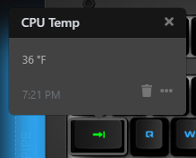

# Windows Management Instrumentation Temperature Monitor

Given a WMI Identifier (e.g. the one for your CPU), this applet will query the temperature and change the color based on a configurable scale.  This applet requires Open Hardware Monitor to be installed and running to work properly.  Download OHM from their website: https://openhardwaremonitor.org/.



## How to find your WMI identifier
1. Open up a PowerShell prompt.  One way to do this is to open the start menu and type PowerShell.
2. Type `Get-WmiObject -namespace "root/OpenHardwareMonitor" -Class Sensor -Filter "SensorType='Temperature'"`  
  That will present you with a list full of entries like this (assuming you have OHM set up properly):
  ```
  __GENUS          : 2
  __CLASS          : Sensor
  __SUPERCLASS     :
  __DYNASTY        : Sensor
  __RELPATH        : Sensor.InstanceId="3891",ProcessId="39315c09-3d8a-41ad-ae2e-9e25862b92b5"
  __PROPERTY_COUNT : 10
  __DERIVATION     : {}
  __SERVER         : YOUR-COMPUTER-NAME
  __NAMESPACE      : root\OpenHardwareMonitor
  __PATH           : \\YOUR-COMPUTER-NAME\root\OpenHardwareMonitor:Sensor.InstanceId="3891",ProcessId="39315c09-3d8a-41ad-ae2e-
                    9e25862b92b5"
  Identifier       : /lpc/nct6791d/temperature/0
  Index            : 0
  InstanceId       : 3891
  Max              : 64.5
  Min              : 28.5
  Name             : CPU Core
  Parent           : /lpc/nct6791d
  ProcessId        : 39315c09-3d8a-41ad-ae2e-9e25862b92b5
  SensorType       : Temperature
  Value            : 41
  PSComputerName   : YOUR-COMPUTER-NAME
  ```
3. Identify the entry you're most interested in.  For my CPU, the above entry is the correct item.  I found the `Name` field to be most useful.
4. Copy the `Identifier` field.  In the above example, it is `/lpc/nct6791d/temperature/0`.
5. Configure the applet's WMI Identifier field with this value


## FAQ
1. Can I use this for WMI values other than temperatures?
Effectively, yes.  Once the number ranges and color spectrums are configurable, you could in theory use this to show status on any **numerical** WMI entry's value by configuring the identifier to the desired entry.
1. Will you make a Linux/MacOS version of this?
Not likely as I don't use my keyboard on other platforms and thus testing would be arduous.